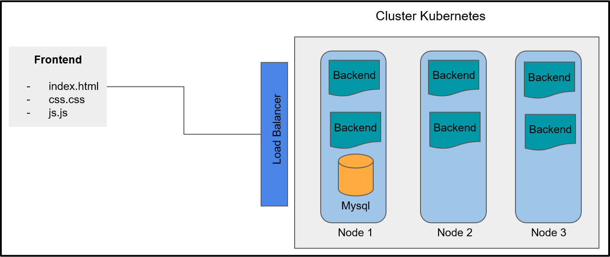

## Aplicação Web em um Contêiner Apache HTTPD
Neste projeto, que faz parte de uma série de aulas da [DIO](https://www.dio.me/), será criadas as imagens dos contêineres e serviços necessários no Kubernetes para que a aplicação esteja pronta para produção.


Estrutura do projeto:
```
.
├── backend
|   ├── conexao.php
|   ├── dockerfile
|   └── index.html
├── database
|   ├── dockerfile
|   └── sql.sql
├── frontend
|   ├── css.css
|   ├── index.html
|   └── js.js
├── deployment.yaml
├── script.bat
├── script.sh
├── services.yaml
└── README.md

```

## Arquitetura do Cluster e Aplicação

